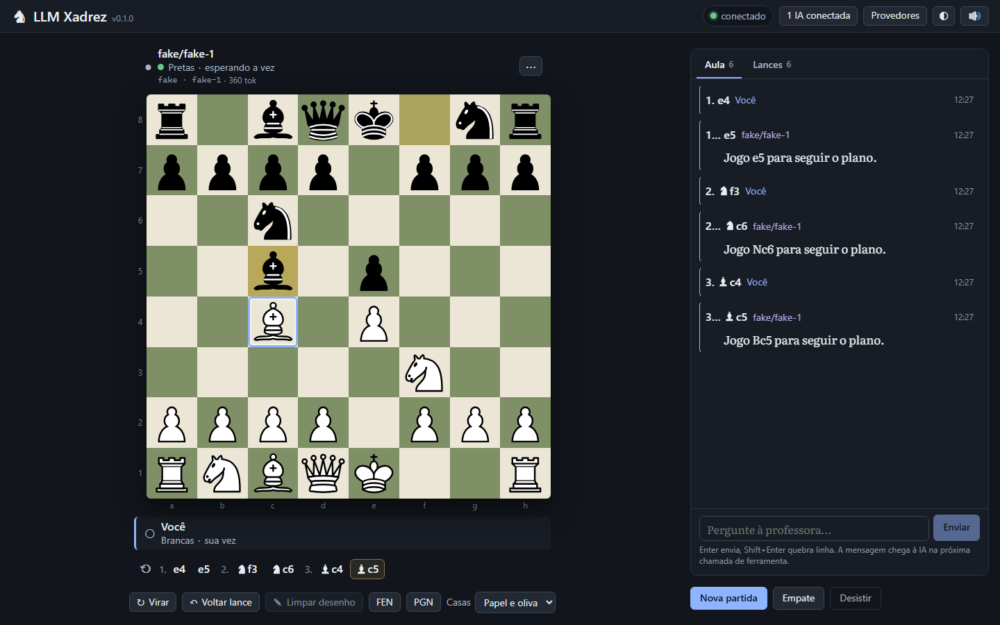

# ♞ LLM Xadrez

Tabuleiro de xadrez web para jogar **com** uma IA — e aprender enquanto joga. A IA move as
peças de verdade, dita cada lance e comenta como uma professora. O servidor guarda o estado
e devolve a posição completa a cada chamada, então a IA nunca "se perde" na partida.

Duas formas de pôr uma IA no tabuleiro, e elas convivem na mesma partida:

- **pelo seu chat**, via **MCP** — Claude Code, Claude Desktop, Jan, Codex, ChatGPT…;
- **pelo próprio servidor**, que fala direto com um provedor de LLM (OpenRouter, a API da
  Anthropic, ou um modelo **local** no Ollama / LM Studio / llama.cpp / vLLM / Jan) e senta
  num assento sozinho — sem cliente de chat nenhum.

Também dá para sentar **duas IAs** uma contra a outra e assistir.



## Rodando

```bash
npm install
npm run dev        # servidor em http://localhost:3939 + Vite em http://localhost:5173
# ou, em produção:
npm run build && npm start   # tudo em http://localhost:3939
# ou com Docker:
docker compose up -d --build # http://localhost:3939, dados em ./data (ver docs/08)
```

**Com um cliente MCP:** o endpoint é `http://localhost:3939/mcp`. Como conectar Claude Code
/ Claude Desktop / Claude.ai / ChatGPT / Codex / Jan / outros:
[docs/05](docs/05-conectar-clientes.md) — a própria UI mostra o comando do seu cliente. No
chat: *"vamos jogar xadrez, eu de brancas, me ensine enquanto jogamos"* (ou, se a partida
já está esperando a IA, *"entre na partida de xadrez que está esperando (join_game)"*).

**Com um bot do servidor:** ponha a chave no `.env` (ou suba um modelo local — nesta
máquina, em outra da rede ou um servidor seu com chave), confira ou cadastre no botão
**Provedores** do header e escolha "Bot do servidor" no assento em *Nova partida*.
Passo a passo: [docs/05 → "Ou use um bot do servidor"](docs/05-conectar-clientes.md#ou-use-um-bot-do-servidor).

```bash
cp .env.example .env     # e preencha OPENROUTER_API_KEY ou ANTHROPIC_API_KEY
```

Chaves de API ficam **só no ambiente**. O `providers.json` (commitado) guarda apenas o
*nome* da variável; a UI nunca envia nem recebe uma chave.

## Documentação
| Doc | Conteúdo |
|-----|----------|
| [00-visao](docs/00-visao.md) | o problema, a ideia, modos de jogo, princípios |
| [01-arquitetura](docs/01-arquitetura.md) | stack, pastas, fluxo de dados, sessões/assentos |
| [02-contrato-mcp](docs/02-contrato-mcp.md) | ferramentas, prompt, recursos, formato do estado |
| [03-servidor](docs/03-servidor.md) | GameStore, bots, REST, WebSocket, persistência, testes |
| [04-frontend](docs/04-frontend.md) | direção visual, layout, componentes, acessibilidade |
| [05-conectar-clientes](docs/05-conectar-clientes.md) | clientes MCP, bots do servidor, 2 IAs, túnel |
| [06-roadmap](docs/06-roadmap.md) | o que está pronto e o que vem depois |
| [07-guia-agentes](docs/07-guia-agentes.md) | regras para quem implementa |
| [08-docker](docs/08-docker.md) | container, volumes, variáveis |
| [09-plano-provedores-gateway](docs/09-plano-provedores-gateway.md) | plano dos bots via provedores (implementado) |
| [10-plano-redesign-ux](docs/10-plano-redesign-ux.md) | plano do redesign de UX (implementado) |
| [11-execucao](docs/11-execucao.md) | registro da execução dos planos 09 e 10 |
| [12-teclado](docs/12-teclado.md) | jogar uma partida inteira só com o teclado |

Contrato de tipos compartilhado: [`shared/types.ts`](shared/types.ts).

## Scripts
`npm run dev` · `npm run build` · `npm start` · `npm test` · `npm run typecheck` ·
`npm run smoke` · `npm run smoke:bot` · `npm run play`

- **`npm run smoke`** — cliente MCP real que joga duas partidas completas contra o servidor
  (humano vs LLM até o mate; LLM vs LLM). Termina com `OK`.
- **`npm run smoke:bot`** — os bots internos pela API REST, com o provedor determinístico
  `fake` (sem rede, sem custo). Com `--provider lmstudio|ollama|openrouter|anthropic` roda
  contra um provedor de verdade — e dá **SKIP** (exit 0) se ele não estiver disponível.
- **`npm run play`** — uma "IA de mentira" (cliente MCP real) que joga e comenta, para
  testar o tabuleiro sem gastar token
  ([docs/05](docs/05-conectar-clientes.md#testar-sem-um-cliente-llm-npm-run-play)).

Para desenvolver a interface sem servidor: `?mock=1` na URL (e `waiting`, `llmvsllm`,
`finished`, `empty`, `bots`, `botsvsbots` — [docs/04](docs/04-frontend.md#cenários-sem-servidor-mock)).

## Validado

### 2026-09-22 — bots via provedores e redesign de UX

Implementação dos planos [09](docs/09-plano-provedores-gateway.md) e
[10](docs/10-plano-redesign-ux.md); registro por onda em [docs/11](docs/11-execucao.md).
Ambiente: Windows 11, Node 24, servidor real em produção, Chromium via Playwright.

| Verificação | Resultado |
|---|---|
| `npm test` | **192 testes** em 9 arquivos, verdes (eram 58) |
| `npm run typecheck`, `npm run build` | limpos |
| `npm run smoke` (MCP) | `OK`, sem regressão |
| `npm run smoke:bot` (provedor `fake`) | `OK` — humano vs bot com `usage` contabilizado, mensagem do aluno virando comentário, parar/retomar, bot vs bot |
| Partida humano vs bot criada **pela UI** contra o servidor real (`BOT_FAKE_PROVIDER=1`) | o bot senta, joga, comenta; a placa mostra modelo, status e tokens |
| Acessibilidade: **axe-core 4.x via Playwright** (`wcag2a`/`2aa`/`21a`/`21aa`/`22aa`/`best-practice`) | **0 violações em 17 cenários**, incluindo com `<dialog>` e `popover` abertos |
| Contraste, alvos de toque e reflow por `getComputedStyle` | 0 textos abaixo de AA, 0 alvos fora do mínimo, sem rolagem horizontal em 1440 / 1024 / 390 px |
| Partida inteira jogada **só com o teclado** contra o servidor real | funciona; roteiro em [docs/12](docs/12-teclado.md) |
| Adaptador Anthropic | validado com o SDK mockado (17 testes) e com um mock local da Messages API |
| Adaptador OpenAI-compatível | validado com `fetch` mockado sobre respostas reais de OpenRouter, Ollama e LM Studio |

**O que *não* foi verificado** — e por quê:

- **Nenhuma chamada a um provedor real.** Não há `.env` com chave nesta máquina nem modelo
  local no ar, então `npm run smoke:bot` com provedor de verdade dá **SKIP** em todas as
  variantes. Tudo que existe é mock e o provedor `fake`.
- **O Lighthouse nunca rodou.** Não há Chrome nem LH CLI aqui. A medição de acessibilidade
  é a da tabela acima; nenhum doc deste projeto afirma nota de Lighthouse.
- **O fluxo "zero → IA conectada" não foi testado com um cliente MCP no ar** (o servidor
  `xadrez` do `.mcp.json` está com `ConnectionRefused` nesta máquina). O assistente de
  conexão foi validado com fixtures e contra o backend real — detectou sozinho duas sessões
  MCP sem assento —, mas falta o teste com o cliente conectado.
- **Leitor de tela real** (NVDA/VoiceOver) não foi usado: os anúncios foram conferidos pelo
  conteúdo das regiões `aria-live`.
- As capturas de **IA vs IA** e do contador **"pensando há N s"** vieram de fixture
  (`?mock=botsvsbots`): com dois bots `fake`, a partida real acaba em ~6 s e o modelo
  responde em ~1 ms.

Itens ainda abertos estão no [roadmap](docs/06-roadmap.md#fase-4--fechar-o-que-ficou-aberto).

### 2026-09-22 — MVP jogável

Primeira validação de ponta a ponta, antes do redesign: `npm run smoke` com cliente MCP
real (`@modelcontextprotocol/sdk` 1.30, Streamable HTTP), partida humano vs LLM pela UI com
comentários, setas e casas destacadas, mensagens do aluno chegando à IA, voltar lance,
desistir, PGN, IA vs IA com dois `npm run play`, layout de 420 px e console sem erros.
Capturas da interface daquele momento: [`ui.png`](docs/img/ui.png),
[`ui-mobile.png`](docs/img/ui-mobile.png) — e, lado a lado com o resultado do redesign, os
`atual-*.png` em [`docs/img/redesign/`](docs/img/redesign/).

## Limitações conhecidas

- O humano não pode jogar antes de a IA sentar (a partida fica em `waiting`).
- `make_move.comment_category` é aceito mas não armazenado: o comentário do lance sempre
  aparece como "plano". Para outra categoria, use a tool `comment`.
- **Não existe CRUD de perfis de bot**: perfis se editam no `providers.json`, ou se escolhe
  "provedor + modelo" direto no diálogo de nova partida.
- Sem streaming: o comentário do bot aparece quando a tool é executada, não enquanto o
  modelo escreve.
- O custo em dólares do adaptador Anthropic é **estimado** por uma tabela local de preços
  (a Messages API não devolve custo).
- Claude.ai, ChatGPT e o "custom connector" do Claude Desktop chamam o servidor da nuvem:
  exigem túnel HTTPS, `PUBLIC_URL`/`ALLOWED_HOSTS` e o token na URL (`?token=`), e esse
  caminho não foi testado de ponta a ponta com um túnel real.
- Abrir a UI de outro aparelho da rede exige configurar `HOST`/`BIND_ADDR`,
  `ALLOWED_HOSTS` e, para administrar provedores de lá, `ADMIN_TOKEN` (docs/05).
- Em automação, o `drag` de uma peça precisa de eventos de ponteiro em passos — use
  clique-clique ou o teclado ([docs/04](docs/04-frontend.md)).
