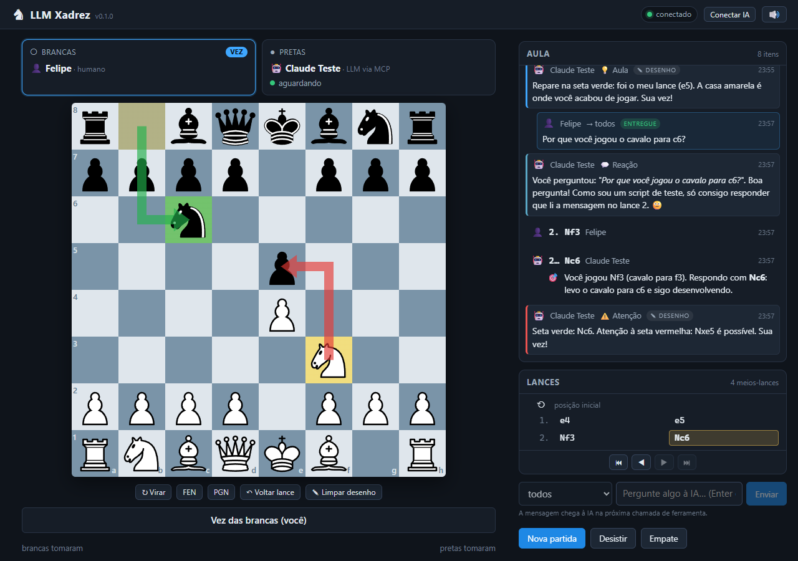

# ♞ LLM Xadrez

Tabuleiro de xadrez web conectado a LLMs via **MCP**. A IA move as peças de verdade, dita
cada lance e comenta como uma professora. O servidor guarda o estado e devolve a posição
completa a cada chamada, então a IA nunca "se perde" na partida. Também dá para sentar
**duas LLMs** uma contra a outra e assistir.

## Rodando

```bash
npm install
npm run dev        # servidor em http://localhost:3939 + Vite em http://localhost:5173
# ou, em produção:
npm run build && npm start   # tudo em http://localhost:3939
```

Endpoint MCP: `http://localhost:3939/mcp`. Como conectar Claude Code / Claude Desktop /
outros: [docs/05-conectar-clientes.md](docs/05-conectar-clientes.md).

No chat: *"vamos jogar xadrez, eu de brancas, me ensine enquanto jogamos"*.

## Documentação
| Doc | Conteúdo |
|-----|----------|
| [00-visao](docs/00-visao.md) | o problema, a ideia, modos de jogo, princípios |
| [01-arquitetura](docs/01-arquitetura.md) | stack, pastas, fluxo de dados, sessões/assentos |
| [02-contrato-mcp](docs/02-contrato-mcp.md) | ferramentas, prompt, recursos, formato do estado |
| [03-servidor](docs/03-servidor.md) | GameStore, REST, WebSocket, persistência, testes |
| [04-frontend](docs/04-frontend.md) | layout e componentes da UI |
| [05-conectar-clientes](docs/05-conectar-clientes.md) | Claude Code, Claude Desktop, túnel, 2 LLMs |
| [06-roadmap](docs/06-roadmap.md) | fases e divisão de trabalho |
| [07-guia-agentes](docs/07-guia-agentes.md) | regras para quem implementa |

Contrato de tipos compartilhado: [`shared/types.ts`](shared/types.ts).

## Scripts
`npm run dev` · `npm run build` · `npm start` · `npm test` · `npm run smoke` · `npm run play` ·
`npm run typecheck`

`npm run play` sobe uma "IA de mentira" (cliente MCP real que joga e comenta) para testar o
tabuleiro sem gastar tokens — ver [docs/05](docs/05-conectar-clientes.md#testar-sem-um-cliente-llm-npm-run-play).

## Validado em 2026-09-22

Ambiente: Windows 11, Node 24, `npm start` (produção, `web/dist`), navegador Chromium via
Playwright, cliente MCP `scripts/mcp-play.ts` (SDK `@modelcontextprotocol/sdk` 1.30,
Streamable HTTP).



| Cenário | Resultado |
|---------|-----------|
| `npm run typecheck`, `npm test` (58 testes), `npm run build` | verdes |
| `npm run smoke` contra o servidor em `:3939` | `OK` (humano vs LLM até o mate do pastor; LLM vs LLM 4 lances + empate acordado) |
| UI: "Nova partida → Eu de brancas vs IA" | assento preto mostra "Aguardando IA — conecte via MCP" com a URL do `/mcp` e botão copiar; tabuleiro travado até a IA sentar (`status: waiting`) |
| `npm run play` (join black) | assento mostra "🤖 Claude Teste · LLM via MCP — aguardando"; título da aba vira "♟ Sua vez" |
| Humano joga `e4` (clique-clique) e `Nf3` (arrastar) | lance no feed e na lista; a IA responde em ~1,5 s com comentário inline (🎯) e um comentário 💡/⚠️ com tag "desenho": setas verde/vermelha e casas coloridas aparecem no tabuleiro |
| Humano joga o lance seguinte | setas/casas somem imediatamente (regra `highlight.ply === state.ply`), "Limpar desenho" desabilita |
| Mensagem pelo MessageBox ("Por que você jogou o cavalo para c6?") | o `wait_for_turn` do script recebe `event: "message"` em ~1 s; a IA responde com `comment` (💬 Reação); o item no feed muda para "entregue" |
| "Voltar lance" | desfaz 2 meios-lances (até antes do último lance humano); a IA recebe `event: "takeback"` |
| "Desistir" | confirmação inline "Desistir mesmo? Sim, desisto / Não"; status "Felipe desistiu — <nome da IA> venceu" (mesmo depois de a IA chamar `leave_game`); a IA recebe `game_over` |
| "PGN" | `GET /api/pgn` com `Content-Disposition: attachment`, comentários dos lances como `{...}` |
| "Conectar IA" | modal com `claude mcp add --transport http xadrez http://localhost:3939/mcp` e config do Claude Desktop; fecha com Esc |
| "IA vs IA (assistir)" + dois `npm run play` (`LLM Alpha` brancas, `LLM Beta` pretas) | 7 meios-lances alternados; feed com comentários e setas das duas; os dois nomes nos assentos |
| `POST /api/game` com uma LLM ainda conectada | ela continua sentada, recebe `new_game` e joga a partida nova |
| Layout 420 px | coluna única, sem rolagem horizontal ([docs/img/ui-mobile.png](docs/img/ui-mobile.png)) |
| Console do navegador | 0 erros, 0 avisos em todos os cenários |
| `claude mcp list` / `claude mcp get xadrez` | `.mcp.json` reconhecido (`Project config`, HTTP, `http://localhost:3939/mcp`); status "Pending approval (run `claude` to approve)" — a aprovação do servidor de projeto é interativa, dentro do `claude` |

Correções feitas nessa validação: a UI passou a esconder o destaque quando `highlight.ply`
difere do ply atual (antes as setas ficavam após o lance); `leave_game` mantém o nome no
assento vazio e a `StatusBar` usa o nome da cor como fallback (antes: "Felipe desistiu —  venceu");
mensagem de `game_not_active` diferencia "ainda não começou" de "o oponente saiu".

Limitações conhecidas: o humano não pode jogar antes de a IA sentar; `make_move.comment_category`
é aceito mas não armazenado (o comentário do lance sempre aparece como "plano"); o `drag` de uma
peça em automação precisa de eventos de ponteiro em passos (ver docs/04).
