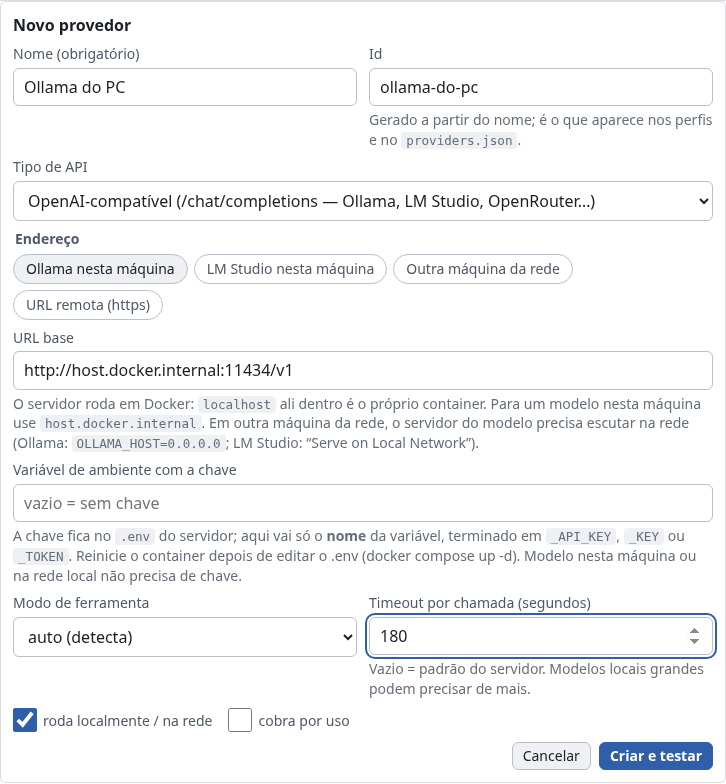
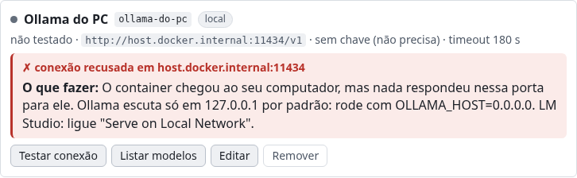

# 05 — Conectando clientes MCP

Servidor no ar: `npm start` (ou `npm run dev`), ou `docker compose up -d` (docs/08).
Endpoint MCP: `http://localhost:3939/mcp`. A própria UI mostra o comando certo para o seu
cliente no onboarding ("Conecte a professora") e em **Conectar IA → Ver todas as opções**,
já ajustado ao runtime (Docker ou Node) e ao modo de autenticação do servidor.

> **Ou pule tudo isto e use um bot do servidor.** Este documento é sobre plugar um *cliente
> de chat* (Claude Code, Claude Desktop, Jan, Codex…) no tabuleiro. Se o que você quer é só
> jogar contra uma IA, o servidor sabe falar direto com um provedor de LLM e sentar sozinho
> no assento — sem cliente nenhum. Veja [**"Ou use um bot do servidor"**](#ou-use-um-bot-do-servidor),
> no fim desta página.

## Token (`MCP_TOKEN`)

Sem `MCP_TOKEN` no `.env`, `/mcp` não pede nada — o normal quando tudo roda no mesmo
computador. Com ele definido, toda requisição a `/mcp` precisa do token, de um destes dois
jeitos:

- header `Authorization: Bearer <MCP_TOKEN>` — Claude Code, `mcp-remote`, Codex, Cursor, Jan;
- query `?token=<MCP_TOKEN>` na URL — para clientes que **não** deixam configurar header
  (Claude.ai, ChatGPT): `https://<host>/mcp?token=<MCP_TOKEN>`.

A UI nunca mostra o valor (ela só sabe que existe um token: `ServerInfo.mcpAuth = "token"`):
os snippets usam o marcador `<MCP_TOKEN>`, e o valor está no `.env` do servidor.

> **Nota de honestidade:** token na URL é mais fraco que no header — ele fica salvo na
> configuração do conector e pode aparecer em logs de proxy. Serve para o caso "túnel aberto
> por uma tarde"; use um valor longo e troque-o depois.

## Claude Code (CLI)
Neste repositório já existe `.mcp.json`, então basta abrir o `claude` dentro da pasta.
Para usar **em qualquer pasta** (escopo de usuário):
```bash
claude mcp add -s user --transport http xadrez http://localhost:3939/mcp
# com MCP_TOKEN:
claude mcp add -s user --transport http xadrez http://localhost:3939/mcp \
  --header "Authorization: Bearer <MCP_TOKEN>"
```
Depois, no chat: `/mcp` para conferir a conexão, e "vamos jogar xadrez, eu de brancas".
Dica: usar o prompt do servidor — `/mcp` → `xadrez` → prompt `chess_teacher`.

## Claude Desktop
Use a ponte stdio `mcp-remote` em `claude_desktop_config.json` (Settings → Developer →
Edit Config; `%APPDATA%\Claude\claude_desktop_config.json` no Windows):
```json
{
  "mcpServers": {
    "xadrez": {
      "command": "npx",
      "args": ["-y", "mcp-remote", "http://localhost:3939/mcp", "--allow-http"]
    }
  }
}
```
Com `MCP_TOKEN`, acrescente o header — por variável de ambiente, porque o Claude Desktop
no Windows quebra argumentos que contêm espaço (recomendação do README do `mcp-remote`):
```json
"args": ["-y", "mcp-remote", "http://localhost:3939/mcp", "--allow-http",
         "--header", "Authorization:${AUTH_HEADER}"],
"env": { "AUTH_HEADER": "Bearer <MCP_TOKEN>" }
```
Reiniciar o Claude Desktop. As tools aparecem no ícone de ferramentas do chat.

**"Add custom connector" não serve para `localhost`.** O conector customizado do Claude
Desktop (Settings → Connectors) é o mesmo do Claude.ai: quem chama o servidor é a nuvem da
Anthropic, não o seu computador. Ele só funciona com uma URL **pública HTTPS** — veja a
seção seguinte. Para uso local, fique com o `mcp-remote`.

## Claude.ai (web e celular) e ChatGPT (modo desenvolvedor)

Os dois chamam o servidor **a partir da nuvem** e não mandam header customizado. Então:
URL pública HTTPS (túnel) + token na query.

1. No `.env` do servidor:
   ```bash
   MCP_TOKEN=uma-senha-longa-e-aleatoria
   PUBLIC_URL=https://<seu-tunel>.trycloudflare.com   # a URL que o túnel mostrar
   ALLOWED_HOSTS=.trycloudflare.com                    # aceita o Host do túnel
   ```
   Sem `ALLOWED_HOSTS` (ou `PUBLIC_URL` com o host do túnel), o servidor recusa as
   requisições do túnel com `403 Host não permitido: "…"` — é a proteção contra DNS
   rebinding, que vale para **todas** as rotas (UI, `/api`, `/ws`, `/mcp`). Um valor
   começando com `.` (ou `*.`) vale para o domínio e qualquer subdomínio; `*` desliga a
   verificação (só com `MCP_TOKEN`, ou numa rede em que você confia).
2. Abra o túnel e deixe a janela aberta:
   ```bash
   npx cloudflared tunnel --url http://localhost:3939
   ```
   A URL de um túnel rápido muda a cada execução: atualize `PUBLIC_URL` e reinicie o
   servidor (`npm start`, ou `docker compose up -d` no Docker).
3. No cliente, a URL do conector é `https://<seu-tunel>.trycloudflare.com/mcp?token=<MCP_TOKEN>`,
   autenticação "None"/"No auth":
   - **Claude.ai**: Settings → Connectors → Add custom connector.
   - **ChatGPT**: Settings → Apps & Connectors → Advanced settings → Developer mode →
     Create.
4. Feche o túnel ao terminar. Enquanto ele estiver aberto, a **UI** também fica acessível
   pela URL pública — e a UI não tem senha (a gravação de provedores, sim: ver
   [Administração](#administração-a-tela-provedores-de-outro-computador)).

> **Nota de honestidade:** o caminho Claude.ai/ChatGPT → túnel → `?token=` foi escrito a
> partir do contrato do servidor e da documentação dos clientes; não foi exercitado de
> ponta a ponta com um túnel real nesta máquina.

## OpenAI Codex (app desktop / CLI)
Em `~/.codex/config.toml`:
```toml
[mcp_servers.xadrez]
url = "http://localhost:3939/mcp"
startup_timeout_sec = 30
tool_timeout_sec = 180
# com MCP_TOKEN:
# http_headers = { Authorization = "Bearer <MCP_TOKEN>" }
```
`tool_timeout_sec` precisa passar dos 25 s do `wait_for_turn`. Conferir com
`codex mcp list` (deve listar `xadrez` como `enabled`). Reinicie o app Codex.

## Jan (jan.ai)
Jan aceita servidores MCP HTTP direto. Em `%APPDATA%\Jan\data\mcp_config.json`, dentro
de `mcpServers`:
```json
"xadrez": {
  "active": true,
  "type": "http",
  "url": "http://localhost:3939/mcp",
  "command": "", "args": [], "env": {}, "headers": {}
}
```
Com token, `"headers": { "Authorization": "Bearer <MCP_TOKEN>" }`. Ou pela UI: Settings →
MCP Servers → Add → tipo HTTP. Reinicie o Jan (ou desligue/ligue o servidor na lista).
`toolCallTimeoutSeconds` em `mcpSettings` deve passar de 25 s. Modelos locais pequenos
podem ter tool calling fraco; prefira um modelo com suporte a tools (Qwen, Llama 3.x instruct).

## Cursor e outros (Windsurf, Cline, Continue…)
Com suporte a MCP remoto/HTTP, use a URL direto. No Cursor (`~/.cursor/mcp.json`):
```json
{ "mcpServers": { "xadrez": { "url": "http://localhost:3939/mcp" } } }
```
(com token: `"headers": { "Authorization": "Bearer <MCP_TOKEN>" }`). Clientes só-stdio usam
a ponte como comando do servidor:
```bash
npx -y mcp-remote http://localhost:3939/mcp --allow-http
# com token: … --header "Authorization: Bearer <MCP_TOKEN>"
```

## Docker
Com `docker compose up -d --build` (ver docs/08), o endpoint é o mesmo
`http://localhost:3939/mcp` e todas as configurações acima valem sem mudança — a porta é
publicada só em `127.0.0.1` por padrão (`BIND_ADDR`). Se mapear outra porta no host,
defina `PUBLIC_URL=http://localhost:<porta>` para o servidor anunciar a URL certa no
banner, no `/api/health` e na UI.

## Abrir a UI de outro aparelho da rede (celular, tablet)

Por padrão o servidor só atende o próprio computador, e só pelos nomes `localhost` /
`127.0.0.1`. Para abrir `http://192.168.0.10:3939` no celular, três coisas:

1. **Escutar na rede**: `HOST=0.0.0.0` no `.env` (com `npm start`) ou `BIND_ADDR=0.0.0.0`
   (Docker).
2. **Aceitar o endereço**: `ALLOWED_HOSTS=192.168.0.10` (o IP ou nome pelo qual o aparelho
   chega). Sem isso, a resposta é `403 Host não permitido`.
3. **Proteger**: `MCP_TOKEN` (senão qualquer um da rede conecta uma IA) e `ADMIN_TOKEN`
   (para administrar provedores do celular — ver
   [Administração](#administração-a-tela-provedores-de-outro-computador)).

Reinicie o servidor (`docker compose up -d` no Docker).

## Sessões: expiração e retomada
- Uma sessão MCP sem nenhuma requisição há **30 min** é fechada pelo servidor (uma sessão
  bloqueada em `wait_for_turn` conta como ativa). A UI só conta como "cliente conectado"
  as sessões ativas (`mcpSessions[].active !== false`).
- Depois de um restart do servidor (ou da expiração), o cliente recebe
  `Session not found: reconnect (initialize) to start a new session`. A maioria reconecta
  sozinha (um `initialize` com o id velho também é aceito e abre uma sessão nova); se não,
  reconecte à mão (Claude Code: `/mcp` → `xadrez` → reconnect) e peça à IA para chamar
  `join_game` — ela retoma o próprio assento.
- Token errado ou ausente com `MCP_TOKEN` definido: `401 Unauthorized: missing or invalid
  token (use 'Authorization: Bearer <MCP_TOKEN>' or '?token=<MCP_TOKEN>' in the URL)`.
- `new_game` não apaga uma partida em andamento — nem uma que só está esperando a IA
  (humano de brancas, pretas vazias, inclusive num servidor recém-ligado) — sem
  `confirm: true`, e as instruções do servidor mandam a IA usar `join_game` nesses casos. Por
  isso a frase que a UI sugere quando as pretas esperam é *"entre na partida de xadrez que
  está esperando (join_game) e jogue de pretas"*.

## Testar sem um cliente LLM: `npm run play`
`scripts/mcp-play.ts` é uma "IA de mentira": um cliente MCP real
(`StreamableHTTPClientTransport`) que senta num assento e fica no ciclo
`wait_for_turn` ↔ `make_move`, jogando lances de abertura simples (depois capturas/aleatório),
publicando um `comment` com setas e casas após cada lance e respondendo às mensagens do
humano. Serve para validar servidor + UI de ponta a ponta sem gastar tokens.

```bash
npm start                       # servidor no ar (ou npm run dev)
npm run play                    # join_game(color: "black", my_name: "Claude Teste")
# no navegador: Nova partida → "Eu de brancas vs IA" → jogue; a IA responde em ~1 s
```

Variáveis de ambiente (todas opcionais):

| Variável | Default | Descrição |
|----------|---------|-----------|
| `PLAY_URL` | `http://localhost:3939` | base do servidor |
| `PLAY_NAME` | `Claude Teste` | nome exibido na UI |
| `PLAY_COLOR` | `black` | `white` \| `black` \| `random` |
| `PLAY_MODE` | `join` | `join` = `join_game` na partida atual; `new` = `new_game` com `confirm: true` (substitui a atual) |
| `PLAY_OPPONENT` | `human` | só com `PLAY_MODE=new`: `human` ou `llm` |
| `PLAY_FORCE` | `0` | `1` = `join_game(force: true)` |
| `PLAY_MAX_MOVES` | ∞ | sai (`leave_game`) depois de N lances próprios |
| `PLAY_DELAY_MS` | `800` | pausa antes de cada lance (para ver a animação) |
| `PLAY_WAIT_SECONDS` | `25` | `timeout_seconds` do `wait_for_turn` (1–120) |
| `PLAY_TOKEN` | (vazio) | valor do `MCP_TOKEN` do servidor, se houver (vai como `Authorization: Bearer`) |

LLM vs LLM sem nenhum cliente: na UI, "Nova partida → IA vs IA (assistir)" e, em dois
terminais, `PLAY_COLOR=white PLAY_NAME="LLM Alpha" npm run play` e
`PLAY_COLOR=black PLAY_NAME="LLM Beta" npm run play`. O script termina sozinho em
`game_over` (ou em `PLAY_MAX_MOVES`); Ctrl+C também libera o assento.
Já `npm run smoke` (`scripts/mcp-smoke.ts`) é o teste automatizado: roda dois cenários
completos (humano vs LLM até o mate, LLM vs LLM) contra um servidor **próprio**, subido
numa porta livre (`SMOKE_PORT` fixa uma) com `DATA_DIR` temporário e um `MCP_TOKEN`
aleatório, e termina com `OK`. Para testar um servidor que já está no ar, é opt-in:
`SMOKE_URL=http://localhost:3939 [SMOKE_TOKEN=…] npm run smoke` — e lembre que ele cria
partidas nesse servidor.

## Duas LLMs na mesma partida
1. Chat A (ex.: Claude Desktop): "crie uma partida de xadrez de brancas contra outra IA e
   comente cada lance". → `new_game({ my_color: "white", opponent: "llm", my_name: "Claude Desktop" })`.
2. Chat B (ex.: Claude Code): "entre na partida de xadrez que está esperando, você é as
   pretas". → `join_game({ color: "black", my_name: "Claude Code" })`.
3. Ambos ficam em `wait_for_turn` ↔ `make_move`. Você assiste em `http://localhost:3939` e
   pode mandar perguntas para cada uma pelo campo de mensagem.

Observação: cada `wait_for_turn` dura até 25 s por padrão. Se uma LLM demorar mais para
responder, a outra recebe `timeout` e chama de novo — sem perder o lance.

## Timeouts dos clientes
Alguns clientes MCP abortam chamadas de tool longas (Claude Desktop e Claude.ai ficam
perto dos 30–60 s, conforme a versão). Por isso o default de `wait_for_turn` é **25 s**
(máximo 120 s): cabe no limite de qualquer cliente, ao custo de mais chamadas vazias
(`timeout` → chamar de novo). Em cliente com timeout generoso (Codex com
`tool_timeout_sec = 180`), a IA pode pedir `timeout_seconds` maior.

## Ou use um bot do servidor

Um **bot** é o próprio servidor ocupando um assento e conversando com um provedor de LLM —
OpenRouter, a API da Anthropic, ou um modelo local no seu computador (Ollama, LM Studio,
llama.cpp, vLLM, Jan) — pela API compatível com OpenAI. Nenhum cliente de chat envolvido:
você abre o navegador, escolhe o modelo e joga. O plano completo está em
[docs/09](09-plano-provedores-gateway.md); o mapa das peças, em
[docs/03 → "Bots do servidor"](03-servidor.md#bots-do-servidor-serversrcbots).

### 1. Aponte o provedor

`providers.json`, na raiz do repositório, já vem com presets para OpenRouter, Anthropic,
LM Studio e Ollama, e com três perfis de exemplo. Cada provedor aponta para o **nome** de
uma variável de ambiente (`apiKeyEnv`) — a chave em si **nunca** entra nesse arquivo.

```bash
# .env (gitignored)
OPENROUTER_API_KEY=sk-or-v1-…
# ou, para a API da Anthropic direto:
ANTHROPIC_API_KEY=sk-ant-…
```

Modelo local não precisa de chave nenhuma: basta o servidor do modelo estar no ar
(`ollama serve` em `:11434`, LM Studio em `:1234`, llama.cpp em `:8080`, vLLM em `:8000`,
Jan em `:1337`). Modelos pequenos costumam ter tool calling fraco — para eles, use
`"toolMode": "text"` no perfil: o bot pede o lance em texto (`MOVE: Nf3`) e entende a
resposta com um parser tolerante.

### 2. Confira na tela "Provedores"

Botão **Provedores** no header (ele só aparece quando o servidor tem a camada ligada).
Lá dá para **testar a conexão** (latência e nº de modelos, ou o erro com uma **dica** do que
fazer), **listar os modelos**, **criar um provedor novo** ("Novo provedor" ou a partir de
um preset) e editar os existentes — nome, tipo de API, URL base, variável da chave, modo de
ferramenta, timeout. Salvar já roda o teste. A chave aparece só mascarada (`sk-or-…a1b2`) e
é somente leitura: o que você edita é o **nome** da variável, com sugestões das variáveis
com cara de chave que existem no ambiente do servidor (`envKeys`, só os nomes). Campo
opcional apagado na edição é limpo no `providers.json`.



### Seu próprio servidor de modelo

Qualquer servidor que fale a API compatível com OpenAI (`/v1/chat/completions` e
`/v1/models`) serve: Ollama, LM Studio, llama.cpp, vLLM, Jan, LiteLLM, um gateway da sua
empresa. Na tela "Provedores" → **Novo provedor**, os atalhos de endereço cobrem os casos
comuns:

| Onde o modelo roda | URL base | Observações |
|--------------------|----------|-------------|
| **Nesta máquina**, servidor com `npm start` | `http://localhost:11434/v1` (Ollama) · `http://localhost:1234/v1` (LM Studio) | nada a configurar |
| **Nesta máquina**, servidor em **Docker** | `http://host.docker.internal:11434/v1` · `http://host.docker.internal:1234/v1` | `localhost` dentro do container é o próprio container. O compose já traz `extra_hosts: host.docker.internal:host-gateway` (necessário no Linux). O modelo precisa escutar numa interface que o container alcance: **Ollama com `OLLAMA_HOST=0.0.0.0`**, LM Studio com **"Serve on Local Network"** ligado |
| **Outra máquina da rede** | `http://192.168.x.x:11434/v1` | lá, `OLLAMA_HOST=0.0.0.0` (Ollama) ou "Serve on Local Network" (LM Studio), e a porta liberada no firewall |
| **Remoto, com chave** | `https://…/v1` | chave no `.env` com um nome seu (ex.: `MEU_SERVIDOR_API_KEY`) e esse nome em "Variável de ambiente com a chave" |

Endereços de loopback, de rede privada e link-local (`10/8`, `172.16/12`, `192.168/16`,
`100.64/10`, `169.254/16`), `*.local`, `*.lan`, `*.internal`, `*.home.arpa`,
`host.docker.internal` e nomes sem ponto (ex.: um serviço `ollama` do mesmo compose)
contam como provedor **local**: não exigem chave, a menos que o provedor esteja marcado
explicitamente como não local (`"local": false`).

Regras que o servidor aplica ao gravar: a URL precisa ser `http(s)` e sem `usuário:senha@`
(barras no fim são removidas); provedor OpenAI-compatível exige URL; o **nome** da variável
da chave termina em `_API_KEY`, `_KEY` ou `_TOKEN` e não pode ser `MCP_TOKEN` nem
`ADMIN_TOKEN`; o timeout vai de 1 a 600 s. Qualquer corpo com `apiKey`, `key`, `token` ou
`authorization` é recusado com `400`.

Chave com nome próprio: ponha no `.env` (`MEU_SERVIDOR_API_KEY=…`) e **reinicie** o servidor —
as chaves são lidas do ambiente na subida. No Docker, o compose carrega o `.env` inteiro
(`env_file`), então qualquer `*_API_KEY` chega ao container, mas só depois de recriá-lo:
`docker compose up -d`.

O teste de conexão espera até **10 s**; a listagem de modelos, até 20 s. Quando um dos
dois falha, o servidor devolve o erro e uma dica ciente do Docker (ex.: "use
`host.docker.internal`", "o Ollama precisa de `OLLAMA_HOST=0.0.0.0`", "ligue 'Serve on Local
Network' no LM Studio"); a tela mostra a dica em destaque no cartão do provedor (no teste)
ou sob a lista de modelos (na listagem).



> **Nota de honestidade:** as capturas acima são do modo `?mock=docker`, com respostas de
> fixture. O texto das dicas reais é do servidor e pode diferir do fixture.

### Administração: a tela "Provedores" de outro computador

Criar, editar, remover, testar e listar modelos são ações de **administração**. O servidor
as aceita:

- **sempre** do próprio computador (loopback) e dos IPs/CIDRs em `ADMIN_ALLOW_FROM` —
  mesmo com um token definido;
- de qualquer outro endereço, só com `Authorization: Bearer <ADMIN_TOKEN>` (ou `MCP_TOKEN`,
  se `ADMIN_TOKEN` estiver vazio).

No Docker, o navegador do host chega ao container pela ponte do Docker, e por isso o
compose vem com `ADMIN_ALLOW_FROM=172.16.0.0/12` (ver docs/08). Fora dessas regras, a
resposta é `403` com `code: "admin_forbidden"`.

A tela reage sozinha: se o servidor aceita token, aparece o campo **"Token de
administração"** e a ação recusada é repetida depois que você digitar. O token fica só no
`sessionStorage` da aba (some ao fechá-la). Se nenhum token é aceito, a tela fica em
modo leitura e explica o que pôr no `.env`: `ADMIN_TOKEN=…` ou o IP do aparelho em
`ADMIN_ALLOW_FROM` (ex.: `192.168.0.0/24`), e reiniciar o servidor.

### 3. Jogue

**Nova partida** → escolha, para cada assento, `Humano`, `Aguardar MCP` ou `Bot do
servidor`; com bot, escolha um perfil pronto ou "provedor + modelo". Se o provedor for
pago, o diálogo diz o limite que a partida vai respeitar (por padrão **US$ 1,00 ou 400 mil
tokens**, ajustáveis por perfil): estourou, o bot para sozinho e você decide se continua.

Na placa do assento, o menu **"⋯"** traz **Parar / Retomar**, **Trocar de modelo** e
**Liberar assento**. Se o bot travar — chave inválida, crédito acabado, modelo devolvendo
lance ilegal atrás de lance ilegal — um aviso fica na tela até você fechar, com o botão
**Retomar**. Contra um humano, um bot que não consegue jogar **pausa**; contra outro bot,
ele joga um lance legal ao acaso e explica no feed, para a partida não travar.

Bot e sessão MCP convivem na mesma partida: dá para sentar o Claude Code de brancas e um
`qwen3:8b` local de pretas, e assistir. Um bot aparece para o outro lado como "LLM (bot do
servidor)".

### Testar sem gastar nada: `npm run smoke:bot`

```bash
npm run smoke:bot                              # provedor "fake": determinístico, sem rede
npm run smoke:bot -- --provider lmstudio       # local, só roda se :1234 responder
npm run smoke:bot -- --provider ollama --model qwen3:8b
npm run smoke:bot -- --provider openrouter     # só roda com OPENROUTER_API_KEY
npm run smoke:bot -- --provider anthropic      # só roda com ANTHROPIC_API_KEY
```

Sem `--provider`, o script sobe um servidor próprio com `BOT_FAKE_PROVIDER=1` — um provedor
determinístico em memória que joga de um livro de aberturas — e roda quatro cenários pela
API REST: humano vs bot (4 lances, conferindo `usage`), mensagem do aluno virando
comentário, parar/retomar, e bot vs bot.

Com um provedor **real** há um teste de ambiente antes de tudo: local precisa responder em
`GET <baseUrl>/models`; pago precisa da chave no ambiente e do modelo na lista. Faltou
alguma coisa, o script imprime **SKIP** e sai com 0 — ele nunca falha por causa de
ambiente. E aí ele sobe o servidor com um `providers.json` temporário cujo perfil limita a
partida a **US$ 0,05, 120 mil tokens e 4 lances**, e roda só os dois primeiros cenários.
Termina com `OK`, `SKIP` (exit 0) ou `FALHOU` (exit 1).

> **Nota de honestidade:** nesta máquina o smoke com provedor real **sempre deu SKIP** —
> não há `.env` com chave nem nenhum servidor de modelo local no ar. Os adaptadores foram
> validados contra `fetch` mockado, SDK mockado e um mock local da Messages API. Um teste
> contra `api.anthropic.com`, OpenRouter ou um modelo local de verdade continua pendente.

## Solução de problemas
| Sintoma | Causa provável | Ação |
|---------|----------------|------|
| Cliente lista 0 tools | servidor não está no ar / porta diferente | `npm start` (ou `docker compose up -d`); conferir `PORT`/`PUBLIC_URL` |
| `Session not found: reconnect (initialize) to start a new session` | sessão velha: o servidor reiniciou ou a sessão ficou 30 min sem uso | reconectar o cliente (Claude Code: `/mcp` → reconnect); a IA chama `join_game` e retoma o assento |
| `Bad Request: No valid session ID` | o cliente mandou uma requisição sem sessão (não fez `initialize`) | reconectar o cliente |
| `403 Host não permitido: "…"` (UI, API ou MCP) | acesso por um host que o servidor não conhece (túnel, IP da rede, nome da máquina) | `PUBLIC_URL` com a URL usada, ou o host em `ALLOWED_HOSTS` (`.trycloudflare.com` vale para subdomínios); reiniciar |
| `401 Unauthorized: missing or invalid token …` em `/mcp` | `MCP_TOKEN` definido e o cliente não mandou o token (ou mandou outro) | header `Authorization: Bearer <MCP_TOKEN>` ou `?token=<MCP_TOKEN>` na URL |
| Celular na rede não abre a UI | servidor só em loopback, ou host não aceito | [Abrir a UI de outro aparelho](#abrir-a-ui-de-outro-aparelho-da-rede-celular-tablet) |
| Conector customizado do Claude Desktop/Claude.ai não conecta em `localhost` | o conector é chamado da nuvem | `mcp-remote` para uso local; túnel HTTPS para Claude.ai |
| Assento mostra "sem conexão" | sessão MCP caiu | a LLM chama `join_game` na mesma cor (retoma automaticamente) |
| A IA tenta `new_game` e recebe recusa | já existe partida em andamento ou esperando a IA | é o esperado: peça "entre na partida de xadrez que está esperando (join_game)"; para trocar de partida mesmo, "Nova partida" na UI |
| Tela "Provedores" diz "somente leitura" / `403 admin_forbidden` | navegador em outro computador | `ADMIN_TOKEN` no `.env` (e digitar na tela) ou o IP em `ADMIN_ALLOW_FROM`; reiniciar |
| `apiKeyEnv precisa terminar em _API_KEY, _KEY ou _TOKEN` | nome de variável fora da regra | renomeie a variável no `.env` (ex.: `MEU_SERVIDOR_API_KEY`) |
| Não existe o botão "Provedores" | o servidor subiu sem a camada de provedores | conferir `PROVIDERS_FILE` e o log de inicialização |
| `Provedor X sem OPENROUTER_API_KEY no .env` | a variável apontada por `apiKeyEnv` está vazia | definir no `.env` e **reiniciar** o servidor (no Docker: `docker compose up -d`) |
| Teste de provedor local: conexão recusada, servidor em Docker | `localhost` dentro do container | `host.docker.internal` na URL; Ollama com `OLLAMA_HOST=0.0.0.0`; LM Studio "Serve on Local Network" |
| Teste de provedor na rede: tempo esgotado | o servidor do modelo só escuta em 127.0.0.1, ou firewall | `OLLAMA_HOST=0.0.0.0` / "Serve on Local Network"; liberar a porta |
| Bot parado com "limite de gasto atingido" | orçamento da partida estourou | "Retomar" no menu "⋯" zera o contador; para mudar o teto, edite `limits` do perfil no `providers.json` |
| Bot local devolve lance ilegal sem parar | modelo pequeno com tool calling fraco | `"toolMode": "text"` no perfil, ou um modelo maior |
| Bots sumiram depois de reiniciar o servidor | `BOT_AUTORESUME=false`, ou o provedor ficou sem chave | religar a variável; conferir o aviso no log |
